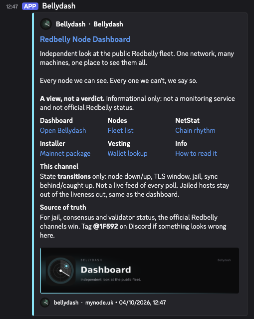
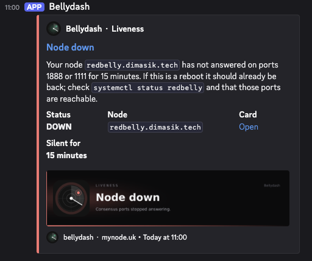
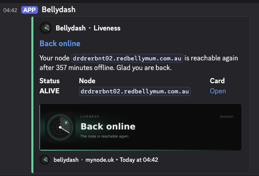
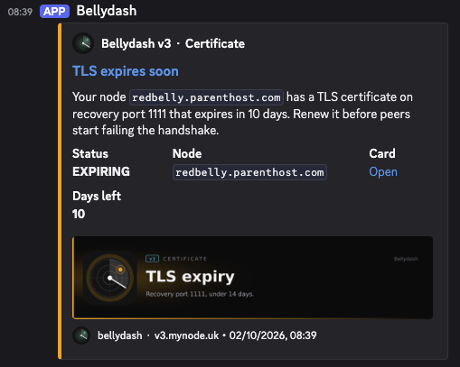
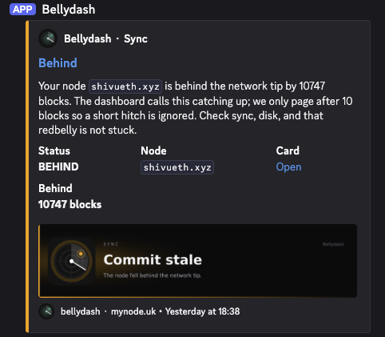
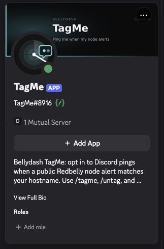

# Discord admin brief: Bellydash alerts and TagMe

This document is for Redbelly Discord administrators who need to judge whether the proposal is safe enough for the official server.

## Goal

A dedicated channel (example name: `#bellydash-alerts` or `#node-alerts`) that:

- Is visible **only** to members with a **node-operators** role (plus staff).
- Receives **automated alerts** about public node state from Bellydash ([mynode.uk](https://mynode.uk)).
- Lets each operator **opt in to a Discord ping** when an alert matches their hostname (`/tagme`).
- Stays **alert-focused**: ordinary chat is removed; slash commands remain usable.

## Architecture (high level)

```
Bellydash probe / DB  -->  public GET /api/v3/nodes
                                |
                         Bellydash alerter (our host)
                                |
                    Discord Incoming Webhook  -->  alert embeds
                                |
                         TagMe bot (our host)
                     /tagme /untag /tags + delete plain chat
```

Important:

- The alerter and TagMe run on **Bellydash infrastructure**, not on Redbelly servers.
- They consume the **same public JSON** anyone can fetch. No Discord bot token is used to read the fleet.
- Alert delivery uses a **channel webhook**. Tagging uses a **separate bot** with a narrow permission set.

## What alerts fire

Only **state transitions**, after internal confirmations (not a raw scrape spam of the whole fleet):

| Kind | Examples |
|---|---|
| Liveness | Node down / back online (ports 1888 / 1111) |
| Certificate | TLS expiring (&lt; 14 days), expired, renewed |
| Jail | Jailed / unjailed (on-chain flag in our public view) |
| Sync | Node behind tip / caught up again |

Optional later (not required for a first trial): inactivity votes, operator-agent heartbeat.

Each message is a Discord embed with hostname, short status, link to the node card on mynode.uk, and a banner image. If someone has `/tagme`'d that hostname, the message also mentions their Discord user id.

The first alerter start only stores a snapshot. It does **not** flood the channel with the current state of every node.

## Example alerts (screenshots)

Real channel posts from the current Bellydash Discord integration. Same layout would appear on a Redbelly node-operators channel.

### Channel intro



### Node down (liveness)



### Back online (liveness)



### TLS expiring (certificate)



### Behind tip (sync)



## TagMe bot (operator opt-in)

### TagMe app profile



Slash commands on the alert channel:

| Command | Effect |
|---|---|
| `/tagme host:example.node` | Subscribe to pings for that hostname (max 5 hosts per Discord account) |
| `/untag host:example.node` | Unsubscribe |
| `/tags` | List your subscriptions |

Replies are **ephemeral**: only the person who ran the command sees the bot reply.

Hostname must appear on the public Bellydash fleet list. Tagging is **trust-based** (no wallet proof in v1). Abuse surface is small (someone gets noisy pings, or blocks a slot); staff can clear a mapping; operators can `/untag`.

Operators do **not** need to "Add App" / User Install on their Discord account. Commands are used on the server channel.

### Chat cleanup (why Manage Messages)

Discord does not offer a clean "slash commands only, Send Messages off" mode: turning off Send Messages usually breaks slash commands too.

So the practical pattern is:

1. Role still has **Send Messages** + **Use Application Commands** (required for slash).
2. TagMe has **Manage Messages** and **deletes ordinary member messages** on that channel.
3. Webhook posts (alerts) and bot/system messages are left alone.
4. Slash command replies stay ephemeral and private to the caller.

This is not "delete every message that does not start with `/`". Slash interactions are not normal messages with a `/` prefix. The bot deletes **plain chat messages** from humans; slash continues to work.

## Permissions checklist

### Channel visibility

| Role | View Channel | Notes |
|---|---|---|
| @everyone | No | Channel hidden |
| node-operators (or equivalent) | Yes | Plus Read History; Send Messages; Use Application Commands |
| Staff / admins | Yes | As you prefer |
| TagMe bot | Yes | Plus Manage Messages on this channel |
| Webhook | n/a | Incoming Webhook attached to the channel |

Suggested denials for the operator role on this channel: Create Public Threads, TTS, and other noise. Optional: reactions.

### Bot invite scopes and rights

- OAuth scopes: `bot`, `applications.commands`
- Channel / role rights needed: **View Channel**, **Use Application Commands**, **Manage Messages**
- **Not** requested: Administrator, Manage Roles, Manage Channels, Kick/Ban, Moderate Members, Manage Webhooks, Read any other channel by default

No Discord privileged gateway intents are required for tagging and chat cleanup (Message Content Intent is not used).

### Webhook

- Create an Incoming Webhook on the alert channel only.
- Share the webhook URL privately with Bellydash maintainers (treat it like a password).
- The webhook posts as the "Bellydash" username with our branding; it is not the TagMe bot.

## Security and risk notes (for evaluation)

### What this integration can do if abused

| Capability | Impact if compromised |
|---|---|
| Webhook URL leak | Attacker can post messages **into that one channel** until you rotate the webhook |
| TagMe bot token leak | Attacker can use the bot's rights: slash + delete messages **where the bot can see**. Keep the bot out of sensitive channels |
| Fake `/tagme` | Someone can subscribe to another hostname (noise / slot use). No access to node keys or servers |

### What this integration cannot do by design

- Cannot read private Discord channels it was not invited to.
- Cannot manage roles, kick members, or change server settings (not granted).
- Cannot reach validator SSH, keys, or Redbelly internal APIs through Discord.
- Does not require operators to authorize a user-installed app on their account.
- Does not store node private keys. Tag map is Discord user id + hostname only.

### Residual / product risks (honest)

- Alerts reflect Bellydash's **external** view, with probe delay and confirmations. They are a helper, not an official Redbelly status feed.
- Discord clients sometimes fail to render embed images; the text still arrives.
- Trust-based tagging without wallet proof (acceptable for a small operator set; can be hardened later).

### Operational controls you keep

- You own the channel, role gate, webhook, and bot invite.
- You can remove the webhook, kick the bot, or delete the channel at any time.
- You can start with a quiet trial (liveness + cert only) before enabling jail alerts.

## What we need from Redbelly Discord admins

1. Create the role-gated channel.
2. Create the Incoming Webhook and send the URL privately to Bellydash ops.
3. Invite TagMe with the scopes/rights above (channel-scoped Manage Messages is enough).
4. Confirm the exact role name used for node operators (for our operator-facing copy).

Bellydash will host the alerter and TagMe, point them at the new webhook and guild, and publish a short how-to for operators (`/tagme`, ephemeral replies, max 5 hosts).

## What this does not replace

- Official Redbelly announcements or incident channels.
- Each operator's own monitoring (Prometheus, Alloy, pager, etc.).
- On-call obligations from the foundation or partners.

## Trial suggestion

If useful: enable the channel for two weeks with **liveness + certificate** alerts only, review noise with a few operators, then decide on jail / sync events.
